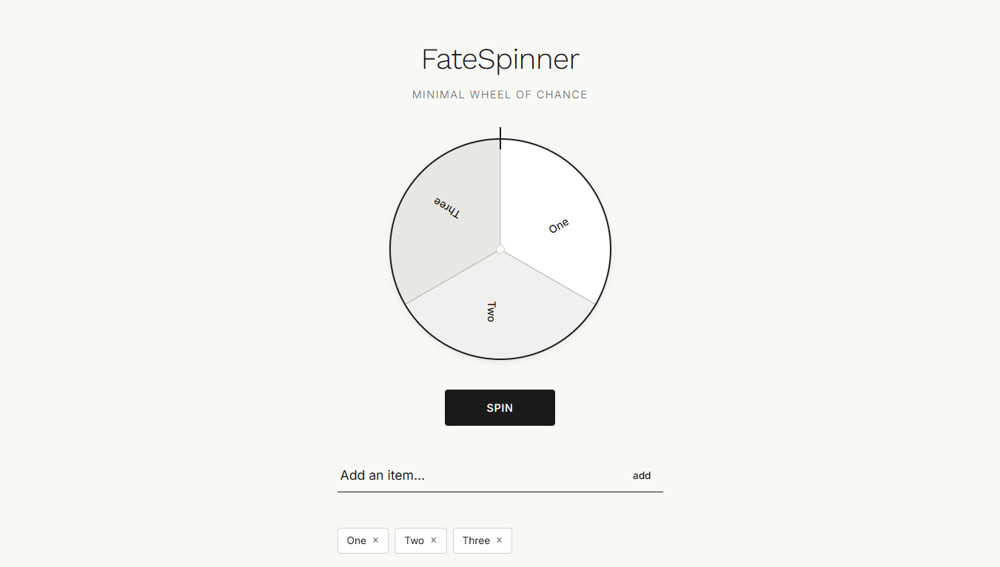
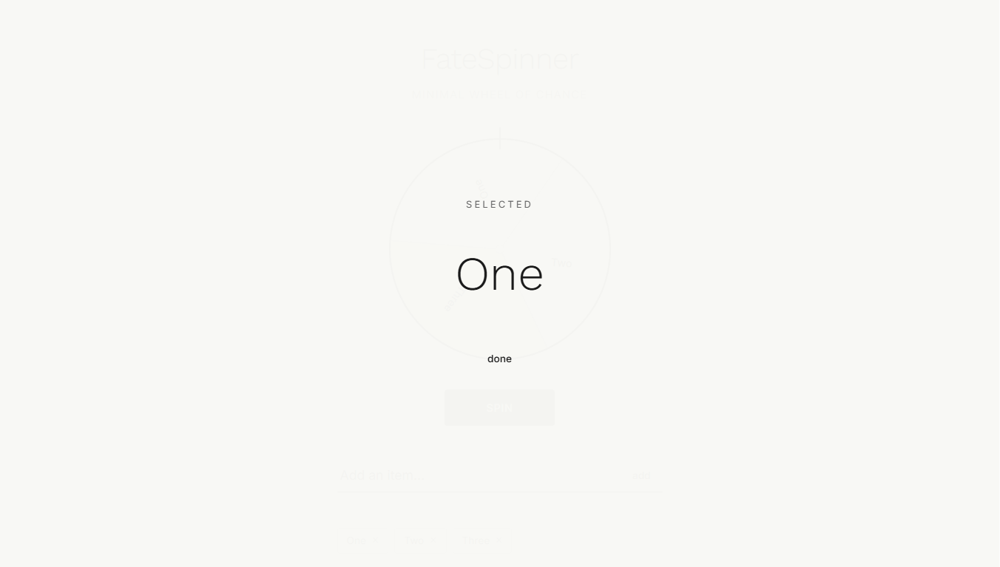

# FateSpinner

> A minimalist, monochromatic decision-maker.

FateSpinner is a distraction-free web application designed to help you make choices with clarity and style. Focused on typography and fluid interaction, it transforms the classic "wheel of fortune" into a human-crafted digital experience.

[**Live Demo**](https://justinreyes28.github.io/FateSpinner/)

### Application Screenshots

<p align="center">
   
</p>

---

## ✦ Key Features

- **Dynamic Wheel Logic**: Real-time segment generation using `conic-gradient`.
- **Typographic Focus**: Clean aesthetics powered by *Inter* and *Work Sans*.
- **Liquid Animation**: Smooth, momentum-based spin mechanics.
- **Minimalist Interface**: A monochromatic design that eliminates visual noise.
- **Responsive by Design**: Seamlessly scales from desktop to mobile screens.

## ✦ Design Philosophy

FateSpinner is built on the principle of **"less is more."** 
- **Monochromatic Palette**: Utilizing a range of grays and whites to focus on the result, not the colors.
- **Flat UI**: Avoiding heavy shadows and gradients in favor of a clean, hand-crafted feel.
- **Motion with Meaning**: Using easing functions that mimic physical momentum.

## ✦ Tech Stack

Built with **Zero Dependencies** to ensure performance and longevity:
- **HTML5**: Semantic structure.
- **CSS3**: Custom properties, Flexbox, and sophisticated transitions.
- **Vanilla JavaScript**: Core logic for randomization, state management, and DOM manipulation.

## ✦ Getting Started

### Local Setup
1. Clone the repository:
   ```bash
   git clone https://github.com/JustinReyes28/FateSpinner.git
   ```
2. Open `index.html` in any modern web browser.

### How to Spin
1. **Input**: Add your options in the input field.
2. **Populate**: Click "Add Word" (or press Enter) to see the wheel update instantly.
3. **Spin**: Hit the "Spin" button and let fate decide.
4. **Reset**: Use the "reset" link to clear the slate.

## ✦ License

This project is licensed under the MIT License - see the [LICENSE](LICENSE) file for details.

---
*Created with care by [Justin Reyes](https://github.com/JustinReyes28)*
